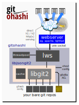

[](https://travis-ci.org/warmcat/gitohashi) [](https://scan.coverity.com/projects/gitohashi) [](https://www.codacy.com/app/lws-team/gitohashi?utm_source=github.com&amp;utm_medium=referral&amp;utm_content=warmcat/gitohashi&amp;utm_campaign=Badge_Grade)  [](https://lgtm.com/projects/g/warmcat/gitohashi/alerts/) [](https://lgtm.com/projects/g/warmcat/gitohashi/context:cpp) [](https://lgtm.com/projects/g/warmcat/gitohashi/context:javascript)


gitohashi Gitweb daemon
-----------------------

Lightweight C Daemon that provides HTTP network transport and HTML presentation
via a JSON representation of bare git repositories discovered via gitolite and
accessed via libgit2.

Supports http/1, http/2 and unix socket (proxiable by, eg, apache, lighttpd or
libwebsocket's own lwsws) serving, avatar proxy caching and many other features.

You can find real deployments at, eg, https://libwebsockets.org/git and
https://warmcat.com/git .



## Features

 - Follows github type web display of repository state, default view is to show
   rendered README.md.  Markdown can include references to files from the
   repo revision directly.

 - No per-page forking... no cgi... no subprocesses... persistant daemon
   architecture

 - Can optionally serve http[s] directly over http/1.1 and http/2, and / or
   serve locally on per-vhost unix socket for integration with existing Apache /
   lighttpd etc server + mod_proxy
   
 - Only needs configuration per-vhost in JSON, the repo configuration and
   access control is taken from gitolite config.

 - Clientside JS, CSS and HTML are provided, along with Markdown parsing
   and syntax highlighting JS to present the JSON + HTML in a modern and
   responsive way.  SVG icons provided.  Customizing the css and HTML
   template encouraged.

 - Transparent caching at JSON block level, keyed using global repository ref
   state... cache invalidated when any ref updated.  ETAG browser cache
   validation supported as well.  Ref hash based cache invalidation, not time-
   based, so no cached view more than a few seconds out of date.
   
 - Multiple vhosts natively supported; each can have their own template html /
   css and gitolite ACL "user" name for automatic repo permissions

 - Safe gravatar proxy cache, served locally, no referrer leaks

 - Very modest on memory, Valgrind-clean, Coverity-clean, works great on a
   Raspberry Pi 3
 
 - I18N (Internationalization) supported keyed off the browser ACCEPT-
   LANGUAGE header, Japanese, Traditional and Simplified Chinese provided on top
   of the default English UI
   
 - Strict Content-Security-Policy out of the box, default-deny, 'self' and
   whitelisted img sources only (travis status etc).  

 - Dynamically linked - binds to distro system libs to stay up to date

# Getting Started

## Build

gitohashi is a small cmake project with only two dependencies, [libgit2](https://libgit2.org/)
and [libwebsockets](https://libwebsockets.org/git/libwebsockets), also easy to build cmake projects.

Full build details: [README-build.md](./doc/README-build.md)

### Config

You can get started by copying ./etc-gitohashi to /etc/gitohashi

```
 $ sudo cp -rp ./etc-gitohashi /etc/gitohashi
```

This contains JSON configuration files for two example gitohashi vhosts, one
directly serving on :443 over https and the other serving on a unix domain
socket for integration with another server.

You'll need to amend, eg, the path to the gitolite repository base dir.

If you are setting that up too, don't forget to create a bare test repo **and
push content to it so gitohashi has something to display**.

You'll need to ensure the gitohashi daemon runs with permissions that allow it
at least read access to the directories and files in the gitolite repository.

For example if the repository is owned by a user 'git', you can choose to run
gitohashi under the same user.  If that makes problems due to, eg, selinux,
another more complex way is run gitohashi as apache, and set the repositor
base dir and underneath to be git:apache and set the "sticky bit" so the
group is inherited.  This also requires `git config` to be set up to have
`sharedRepository = group`, gitolite config is able to force this in the
bare repo config it manages using `config core.sharedRepository = group`

### Startup

The gitohashi `make install` adds a systemd service file, so you can manage it
the same as other services.

However you will need to move it into place if you are installing to, eg,
`/usr/local/...` as it does by default.

```
 $ sudo cp /usr/local/lib/systemd/system/gitohashi.service /usr/lib/systemd/system/
```

Afterwards you can use gitohashi normally with systemd:

```
 $ systemctl start gitohashi
```

### Direct serving

gitohashi can serve on http and https, using http/1.1 and / or http/2 directly.
The default example configuration defines two vhosts, one serving on
http://localhost:443/git and the other serving on a unix domain socket intended
to be proxied by Apache or another frontend server.

### Apache integration

gitohashi can serve over unix sockets, as shown in the `unixskt` example
vhost.  The unix socket should live in `/var/run/`, the example one is at
`/var/run/gitohashi-unixskt`.  Multiple vhosts can each expose their own
unix socket.

gitohashi will take care of unlinking and creating the unix sockets at startup,
as well as changing their owner:group to the owner:group that gitohashi runs
under.

However selinux must be informed that it's OK for the named unix sockets to be
connected to by Apache.  You can do this by allowing apache to connect to
local unix sockets generally with

```
$ sudo semodule -X 300 -i /usr/local/share/gitohashi/gitohashi-selinux.pp
```

Afterwards, for each vhost you want to use gitohashi on Apache, you need to
add

```
SSLProxyEngine on
ProxyPass /git unix:///var/run/gitohashi-unixskt|http://localhost/git
```

For multiple vhosts, `unix:///var/run/gitohashi-unixskt` becomes the per-vhost
unix socket you created in gitohashi's vhost config.

### Serving gitohashi Assets

gitohashi installs its `./assets` directory into
`/usr/local/share/gitohashi` by default.

asset|function
---|---
inconsolata.ttf|Web font for nice monospaced content
jg2.js|The clientside part that turns the JSON into HTML
jg2.css|Helper CSS for formatting jg2.js output
logo.css|CSS SVG Image included by the example template HTML
gitohashi-custom.css|CSS overrides related to the custom HTML template (normally served from wherever the HTML template is served from)
highlight.pack.js|Highlight.js script to perform clientside file markup
github.css|Highlight.js CSS (NB they provide many alternatives...)
showdown.min.js|Showdown script to perform clientside markdown to HTML
showdown.min.js.map|Additional information about minified showdown

Gitohashi also installs an example html template from its `./templates` dir,
`gitohashi-example.html` into `/usr/local/share/gitohashi/templates`.  This
is not designed to be directly served, instead the gitohashi vhost is pointed
to a customized copy of it adapted with a suitable logo, content and css /
fonts.

Assuming you want "sandwiched" JSON-in-HTML mode, two places need to know the
path:

 - you need to inform the library the filepath to the HTML template file in
   the vhost config struct

 - you must serve that dir somehow over HTTP so the client browser can get at
   the rest of the assets mentioned in the HTML.  (The HTML is provided
   directly by gitohashi in sandwich mode, but the other assets are collected
   by the client browser over HTTP).  The provided HTTP template
   assumes it's served from the same server at the virtual path
   `/git/_gitohashi`, but you can change that as needed.

Caching policy in your HTTP server for the assets can be relaxed, since they
will normally only change when gitohashi it updated.

### Integration with gitolite v3

Gitohashi tries to require as little configuration as possible.  One big help
with that is it can use parse gitolite ACLs from the same repo base directory.
That allows you to use gitolite config to control which repos gitohashi can
access and set information about them.

Full details: [README-gitolite.md](./doc/README-gitolite.md) 

## Caching in gitohashi

To minimize the cost of generated, external and static page assets, gitohashi
uses several different types of cache. 

### Avatar cache

gitohashi makes a lot of use of avatars to make it easy to recognize commit
authors and who has contributed.

 - Repeated avatar references on the client side are coalesced to one fetch by
the browser, but on pages with many commits by different people, that can still
add up to a lot of fetches.  The caching policy is controlled by the server the
avatar was fetched from, even though avatars very seldom change.

 - With a third-party avatar provider, there's also a problem your browser is
informing them of every URL you visit via `referrer`, and which avatars are
there.  This may be "too much information".

 - Gravatar is also listed by mozilla as a service that needs protecting against
for privacy; you will lose your green padlock on pages that reference gravatar
directly.

For these reasons gitohashi includes a smart server-side avatar cache.

It's not a generic proxy cache, gitohashi knows when it specifically generates
JSON mentioning an identity, and the avatar cache fetches the related avatar if
it's not already in the cache.  The avatar cache is exposed in a mount serving
static files with a user-controllable cache policy (which you can set to days
or weeks to control the related client traffic).  In this way it's secure
against abuse.

No referrer information is sent, and since the JSON tells the browser to pick
up the avatar images from your server, the client finds no references to
the third-party avatar provider and so no privacy issues.

### Transparent JSON Cache

Gitohashi has a sophisticated transparent JSON cache.

Cache entries are invalidated when the related repo's refs
change; gitohashi maintains a hash of all refs in a repo for this purpose.

It means that deprecated repos nobody pushes to will keep their caches
unless the size limit is reached and the cache content is reaped according to
LRU, while active repos will always have fresh content reflecting their
current status with only a few seconds delay, and the cached versions of that
content will exist until the next push, maximizing their usefulness.

Gitohashi checks the `user-agent` header of the client for "bot" or "Bot", and
if present disables cache generation for the request, so that random bot
spidering doesn't flush meaningful user accesses that may be useful for other
users in the cache.

## Client-side HTTP cache

Assets that may have a safe client-side cache policy (CSS, JS, fonts etc) are
separated out to their own URL base that may have the relaxed caching policy
applied to it.  The generated HTML + JSON is never cached and always produced
live. 

## ETAG client-side HTTP cache

When the client-side cache time expires, the client can still avoid reloading
by using ETAGs (all modern browsers do this automatically).  Gitohashi
understands ETAGs and will reply with a HTTP response code indicating the
cached object is unchanged, renewing the clientside cache copy without having
to resend any content.

## Notes on developing with gitohashi

1. You can run gitohashi from the commandline with sudo, but you must
   override HOME.  libgit2 will try to use any .gitrc in your original user's
   HOME and fail on opening the repos.  Use this kind of thing:
   
```
$ sudo HOME=/tmp valgrind --leak-check=full --show-leak-kinds=all /usr/local/bin/gitohashi
```

2. You can either attach gdb to the gitohashi process even if run by systemd
   using `gdb -p <pid>`, or run it under gdb with, eg
   
```
$ sudo HOME=/tmp valgrind gdb --ex r --args /usr/local/bin/gitohashi
```

## Serving git protocol over https

Gitohashi only does gitweb, which is unrelated to git's optional read-only
https protocol access.  Git's own `git-http-backend` should be used as a
CGI to serve git https protocol.

## XSS mitigation

### Making the most of Content-Security-Policy

Modern browsers understand XSS and allow the server to specify a kind of
"selinux on your web page" at the time the pages are served.  This is
independent of what is on the original page or what may be inserted into the
DOM.

Gitohashi's example HTML template and the example `/etc/gitohashi` conf are
already set for default-deny `Content-Security-Policy` for all types of content,
with specific overrides to allow scripts, CSS and fonts from the same server
that sent the original page, and images additionally from travis / appveyor and
coverity ONLY.

That means inline (injected) scripts and style are specifically disallowed by
the default security policy told to the browser by gitohashi when it serves the
page.  The default CSP is enough to get A+ at https://observatory.mozilla.org .

### Showdown

Generic markdown is unfortunately sucecptible to XSS attacks, made a lot worse
by wanting to allow the input to fall back to raw html.

However we don't need that for README.md type applications, so we perform
the following changes to the markdown input before processing

character|change
---|---
Ampersand|& a m p ;
Less than|& l t ; & # 8 2 0 3;
Greater than|& g t ;
Percent|& # 3 7 ;

The additional zero-width space after the less-than is to defeat Showdown's
suicidal desire to interpret the HTML escape sequence & l t ; as a valid, active
less-than character for opening html tags.

With this the xss test page at ./xss/README.md with several dozen xss variations
does not render to anything active scriptwise.

See https://warmcat.com/git/gitohashi/tree/xss

### Highlight.js

At least for C highlight, providing the same large set of XSS attacks in a .c is
unable to do anything on the client, again by globally preprocessing the
characters critical to the attack variants into escaped forms first.

See https://warmcat.com/git/gitohashi/tree/xss/xss.c

## Upstreams and licenses

### libwebsockets

LGPL2.1+SLE

https://libwebsockets.org/git/libwebsockets

### highlightjs

https://highlightjs.org/

included in gitohashi:

 - assets/highlight.pack.js
 - assets/github.css

```
Copyright (c) 2006, Ivan Sagalaev
All rights reserved.
Redistribution and use in source and binary forms, with or without
modification, are permitted provided that the following conditions are met:

    * Redistributions of source code must retain the above copyright
      notice, this list of conditions and the following disclaimer.
    * Redistributions in binary form must reproduce the above copyright
      notice, this list of conditions and the following disclaimer in the
      documentation and/or other materials provided with the distribution.
    * Neither the name of highlight.js nor the names of its contributors 
      may be used to endorse or promote products derived from this software 
      without specific prior written permission.

THIS SOFTWARE IS PROVIDED BY THE REGENTS AND CONTRIBUTORS ``AS IS'' AND ANY
EXPRESS OR IMPLIED WARRANTIES, INCLUDING, BUT NOT LIMITED TO, THE IMPLIED
WARRANTIES OF MERCHANTABILITY AND FITNESS FOR A PARTICULAR PURPOSE ARE
DISCLAIMED. IN NO EVENT SHALL THE REGENTS AND CONTRIBUTORS BE LIABLE FOR ANY
DIRECT, INDIRECT, INCIDENTAL, SPECIAL, EXEMPLARY, OR CONSEQUENTIAL DAMAGES
(INCLUDING, BUT NOT LIMITED TO, PROCUREMENT OF SUBSTITUTE GOODS OR SERVICES;
LOSS OF USE, DATA, OR PROFITS; OR BUSINESS INTERRUPTION) HOWEVER CAUSED AND
ON ANY THEORY OF LIABILITY, WHETHER IN CONTRACT, STRICT LIABILITY, OR TORT
(INCLUDING NEGLIGENCE OR OTHERWISE) ARISING IN ANY WAY OUT OF THE USE OF THIS
SOFTWARE, EVEN IF ADVISED OF THE POSSIBILITY OF SUCH DAMAGE.
```

### showdown

https://github.com/showdownjs/showdown

included in gitohashi:

 - assets/showdown.min.js

```
Showdown Copyright (c) 2007, John Fraser
http://www.attacklab.net
All rights reserved.

Original Markdown copyright (c) 2004, John Gruber
http://daringfireball.net
All rights reserved.

Redistribution and use in source and binary forms, with or without
modification, are permitted provided that the following conditions are
met:

* Redistributions of source code must retain the above copyright notice,
  this list of conditions and the following disclaimer.

* Redistributions in binary form must reproduce the above copyright
  notice, this list of conditions and the following disclaimer in the
  documentation and/or other materials provided with the distribution.

* Neither the name "Markdown" nor the names of its contributors may
  be used to endorse or promote products derived from this software
  without specific prior written permission.

This software is provided by the copyright holders and contributors "as
is" and any express or implied warranties, including, but not limited
to, the implied warranties of merchantability and fitness for a
particular purpose are disclaimed. In no event shall the copyright owner
or contributors be liable for any direct, indirect, incidental, special,
exemplary, or consequential damages (including, but not limited to,
procurement of substitute goods or services; loss of use, data, or
profits; or business interruption) however caused and on any theory of
liability, whether in contract, strict liability, or tort (including
negligence or otherwise) arising in any way out of the use of this
software, even if advised of the possibility of such damage.
```
