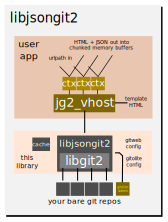
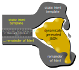

[](https://travis-ci.org/warmcat/gitohashi) [](https://scan.coverity.com/projects/gitohashi) 

gitohashi
---------

Lightweight C Daemon that provides HTTP network transport and HTML presentation
via a JSON representation of bare git repositories.  Supports http/1, http/2 and
unix socket (proxiable by, eg, apache & lighttpd) serving, avatar proxy caching
and many other features.


## Features

 - Follows github type web display of repository state, default view is to show
   rendered README.md.  Markdown can include references to files from the
   repo revision directly.

 - No forking... no cgi... no subprocesses... persistant daemon architecture

 - Can optionally serve http[s] directly over http/1.1 and http/2
 
 - Can optionally serve locally for integration with existing Apache / lighttpd
   etc server via per-vhost unix socket + mod_proxy

 - Clientside JS, CSS and HTML are provided, along with Markdown parsing
   and syntax highlighting JS to present the JSON + HTML from libjsongit2 in
   a modern and responsive way.  SVG icons provided.  Customizing the css and
   HTML template encouraged.

 - Transparent caching at JSON block level, keyed using global repository ref
   state... cache invalidated when any ref updated.  ETAG browser cache
   validation supported as well.  No time-based invalidation so no cached view
   more than a few seconds out of date.
   
 - Multiple vhosts natively supported, integrated with libjsongit2 so each can
   have their own template html and gitolite ACL "user" name for automatic
   permissions

 - Safe gravatar proxy cache, no referrer leaks

 - Very modest on memory, Valgrind-clean, Coverity-clean, works great on a
   Raspberry Pi 3
 
 - I18N (Internationalization) supported keyed off the browser ACCEPT-
   LANGUAGE header, Japanese, Traditional and Simplified Chinese provided on top
   of the default English UI
   
 - Strict Content-Security-Policy out of the box, default-deny, 'self' and
   whitelisted img sources only (travis status etc).  

 - Dynamically linked - binds to distro system libs

# Getting Started

## Build

gitohashi is a small cmake project with only two dependencies, [libgit2](https://libgit2.org/)
and [libwebsockets](https://libwebsockets.org/git/libwebsockets), also easy to
build cmake projects.

Full build details: [README-build.md](./doc/README-build.md)

### Config

You can get started by copying ./etc-gitohashi to /etc/gitohashi

```
 $ sudo cp -rp ./etc-gitohashi /etc/gitohashi
```

This contains JSON configuration files for gitohashi vhosts.

### Startup

The gitohashi `make install` adds a systemd service file, so you can manage it
the same as other services.

However you will need to move it into place if you are installing to, eg,
`/usr/local/...` as it does by default.

```
 $ sudo cp /usr/local/lib/systemd/system/gitohashi.service /usr/lib/systemd/system/
```

Afterwards you can use gitohashi normally with systemd...

```
 $ systemctl start gitohashi
```

### Direct serving

gitohashi can serve on http and https, using http/1.1 and / or http/2 directly.
The default example configuration defines two vhosts, one serving on
http://localhost:443/git and the other serving on a unix domain socket intended
to be proxied by Apache or another frontend server.

### Apache integration

gitohashi can serve over unix sockets, as shown in the `unixskt` example
vhost.  The unix socket should live in `/var/run/`, the example one is at
`/var/run/gitohashi-unixskt`.  Multiple vhosts can each expose their own
unix socket.

gitohashi will take care of unlinking and creating the unix sockets at startup,
as well as changing their owner:group to the owner:group that gitohashi runs
under.

However selinux must be informed that it's OK for the named unix sockets to be
connected to by Apache.  You can do this by allowing apache to connect to
local unix sockets generally with

```
$ sudo semodule -X 300 -i /usr/local/share/gitohashi/gitohashi-selinux.pp
```

Afterwards, for each vhost you want to use gitohashi on Apache, you need to
add

```
SSLProxyEngine on
ProxyPass /git unix:///var/run/gitohashi-unixskt|http://localhost/git
```

For multiple vhosts, `unix:///var/run/gitohashi-unixskt` becomes the per-vhost
unix socket you created in gitohashi's vhost config.

### Serving gitohashi Assets

gitohashi installs its `./assets` directory into
`/usr/local/share/gitohashi` by default.

asset|function
---|---
inconsolata.ttf|Web font for nice monospaced content
jg2.js|The clientside part of libjsongit2 that turns the JSON into HTML
jg2.css|Helper CSS for formatting jg2.js output
logo.css|CSS SVG Image included by the example template HTML
gitohashi-custom.css|CSS overrides related to the custom HTML template (normally served from wherever the HTML template is served from)
highlight.pack.js|Highlight.js script to perform clientside file markup
github.css|Highlight.js CSS (NB they provide many alternatives...)
showdown.min.js|Showdown script to perform clientside markdown to HTML
showdown.min.js.map|Additional information about minified showdown

Gitohashi also installs an example html template from its `./templates` dir,
`gitohashi-example.html` into `/usr/local/share/gitohashi/templates`.  This
is not designed to be directly served, instead the gitohashi vhost is pointed
to a customized copy of it adapted with a suitable logo, content and css /
fonts.

Assuming you want "sandwiched" JSON-in-HTML mode, two places need to know the
path:

 - you need to inform the library the filepath to the HTML template file in
   the vhost config struct

 - you must serve that dir somehow over HTTP so the client browser can get at
   the rest of the assets mentioned in the HTML.  (The HTML is provided
   directly by libjsongit2 in sandwich mode, but the other assets are collected
   by the client browser over HTTP).  The provided HTTP template
   assumes it's served from the same server at the virtual path
   "/git/_gitohashi", but you can change that as needed.

Caching policy in your HTTP server for the assets can be relaxed, since they
will normally only change when gitohashi it updated.

### Integration with gitolite

Gitohashi tries to require as little configuration as possible.  One big help
with that is it can use libjsongit2's ability to parse gitolite ACLs from the
same repo base directory.  That allows you to use gitolite config to control
which repos gitohashi can access and set information about them.

Full details: [README-gitolite.md](https://warmcat.com/git/libjsongit2/tree/doc/README-gitolite.md) 

## Caching in gitohashi

To minimize the cost of generated, external and static page assets, gitohashi
uses several different types of cache. 

### Avatar cache

gitohashi makes a lot of use of avatars to make it easy to recognize commit
authors and who has contributed.

 - Repeated avatar references on the client side are coalesced to one fetch by
the browser, but on pages with many commits by different people, that can still
add up to a lot of fetches.  The caching policy is controlled by the server the
avatar was fetched from, even though avatars very seldom change.

 - With a third-party avatar provider, there's also a problem your browser is
informing them of every URL you visit via `referrer`, and which avatars are
there.  This may be "too much information".

 - Gravatar is also listed by mozilla as a service that needs protecting against
for privacy; you will lose your green padlock on pages that reference gravatar
directly.

For these reasons gitohashi includes a smart server-side avatar cache.

It's not a generic proxy cache, libjsongit2 informs gitohashi when it generates
JSON mentioning an identity, and the avatar cache fetches the related avatar if
it's not already in the cache.  The avatar cache is exposed in a mount serving
static files with a user-controllable cache policy (which you can set to days
or weeks to control the related client traffic).  In this way it's secure
against abuse.

No referrer information is sent, and since the JSON tells the browser to pick
up the avatar images from your server, the client finds no references to
the third-party avatar provider and so no privacy issues.

### Transparent JSON Cache

libjsongit2 has a sophisticated transparent JSON cache described in detail in
its README

https://warmcat.com/git/libjsongit2

Cache entries are invalidated when the related repo's refs
change; libjsongit2 maintains a hash of all refs in a repo for this purpose.

It means that deprecated repos nobody pushes to will keep their caches
unless the size limit is reached and the cache content is reaped according to
LRU, while active repos will always have fresh content reflecting their
current status with only a few seconds delay, and the cached versions of that
content will exist until the next push, maximizing their usefulness.

Gitohashi checks the `user-agent` header of the client for "bot" or "Bot", and
if present disables cache generation for the request, so that random bot
spidering doesn't flush meaningful user accesses that may be useful for other
users in the cache.

## Client-side HTTP cache

Assets that may have a safe client-side cache policy (CSS, JS, fonts etc) are
separated out to their own URL base that may have the relaxed caching policy
applied to it.  The generated HTML + JSON is never cached and always produced
live. 

## ETAG client-side HTTP cache

When the client-side cache time expires, the client can still avoid reloading
by using ETAGs (all modern browsers do this automatically).  Gitohashi
understands ETAGs and will reply with a HTTP response code indicating the
cached object is unchanged, renewing the clientside cache copy without having
to resend any content.

Gitohashi understands etags, 

## Notes on developing with gitohashi

1. You can run gitohashi from the commandline with sudo, but you must
   override HOME.  libgit2 will try to use any .gitrc in your original user's
   HOME and fail on opening the repos.  Use this kind of thing:
   
```
$ sudo HOME=/tmp valgrind --leak-check=full --show-leak-kinds=all /usr/local/bin/gitohashi
```

2. You can either attach gdb to the gitohashi process even if run by systemd
   using `gdb -p <pid>`, or run it under gdb with, eg
   
```
$ sudo HOME=/tmp valgrind gdb --ex r --args /usr/local/bin/gitohashi
```

## XSS mitigation

### Making the most of Content-Security-Policy

Modern browsers understand XSS and allow the server to specify a kind of
"selinux on your web page" at the time the pages are served.  This is
independent of what is on the original page or what may be inserted into the
DOM.

Gitohashi's example HTML template and the example `/etc/gitohashi` conf are
already set for default-deny `Content-Security-Policy` for all types of content,
with specific overrides to allow scripts, CSS and fonts from the same server
that sent the original page, and images additionally from travis / appveyor and
coverity ONLY.

That means inline (injected) scripts and style are specifically disallowed by
the default security policy told to the browser by gitohashi when it serves the
page.  The default CSP is enough to get A+ at https://observatory.mozilla.org .

### Showdown

Generic markdown is unfortunately sucecptible to XSS attacks, made a lot worse
by wanting to allow the input to fall back to raw html.

However we don't need that for README.md type applications, so we perform
the following changes to the markdown input before processing

character|change
---|---
Ampersand|& a m p ;
Less than|& l t ; & # 8 2 0 3;
Greater than|& g t ;
Percent|& # 3 7 ;

The additional zero-width space after the less-than is to defeat Showdown's
suicidal desire to interpret the HTML escape sequence & l t ; as a valid, active
less-than character for opening html tags.

With this the xss test page at ./xss/README.md with several dozen xss variations
does not render to anything active scriptwise.

See https://warmcat.com/git/gitohashi/tree/xss

### Highlight.js

At least for C highlight, providing the same large set of XSS attacks in a .c is
unable to do anything on the client, again by globally preprocessing the
characters critical to the attack variants into escaped forms first.

See https://warmcat.com/git/gitohashi/tree/xss/xss.c

## Upstreams and licenses

### libjsongit2

LGPL2.1+SLE

https://warmcat.com/git/libjsongit2

### libwebsockets

LGPL2.1+SLE

https://libwebsockets.org/git/libwebsockets

### highlightjs

https://highlightjs.org/

included in gitohashi:

 - assets/highlight.pack.js
 - assets/github.css

```
Copyright (c) 2006, Ivan Sagalaev
All rights reserved.
Redistribution and use in source and binary forms, with or without
modification, are permitted provided that the following conditions are met:

    * Redistributions of source code must retain the above copyright
      notice, this list of conditions and the following disclaimer.
    * Redistributions in binary form must reproduce the above copyright
      notice, this list of conditions and the following disclaimer in the
      documentation and/or other materials provided with the distribution.
    * Neither the name of highlight.js nor the names of its contributors 
      may be used to endorse or promote products derived from this software 
      without specific prior written permission.

THIS SOFTWARE IS PROVIDED BY THE REGENTS AND CONTRIBUTORS ``AS IS'' AND ANY
EXPRESS OR IMPLIED WARRANTIES, INCLUDING, BUT NOT LIMITED TO, THE IMPLIED
WARRANTIES OF MERCHANTABILITY AND FITNESS FOR A PARTICULAR PURPOSE ARE
DISCLAIMED. IN NO EVENT SHALL THE REGENTS AND CONTRIBUTORS BE LIABLE FOR ANY
DIRECT, INDIRECT, INCIDENTAL, SPECIAL, EXEMPLARY, OR CONSEQUENTIAL DAMAGES
(INCLUDING, BUT NOT LIMITED TO, PROCUREMENT OF SUBSTITUTE GOODS OR SERVICES;
LOSS OF USE, DATA, OR PROFITS; OR BUSINESS INTERRUPTION) HOWEVER CAUSED AND
ON ANY THEORY OF LIABILITY, WHETHER IN CONTRACT, STRICT LIABILITY, OR TORT
(INCLUDING NEGLIGENCE OR OTHERWISE) ARISING IN ANY WAY OUT OF THE USE OF THIS
SOFTWARE, EVEN IF ADVISED OF THE POSSIBILITY OF SUCH DAMAGE.
```

### showdown

https://github.com/showdownjs/showdown

included in gitohashi:

 - assets/showdown.min.js

```
Showdown Copyright (c) 2007, John Fraser
http://www.attacklab.net
All rights reserved.

Original Markdown copyright (c) 2004, John Gruber
http://daringfireball.net
All rights reserved.

Redistribution and use in source and binary forms, with or without
modification, are permitted provided that the following conditions are
met:

* Redistributions of source code must retain the above copyright notice,
  this list of conditions and the following disclaimer.

* Redistributions in binary form must reproduce the above copyright
  notice, this list of conditions and the following disclaimer in the
  documentation and/or other materials provided with the distribution.

* Neither the name "Markdown" nor the names of its contributors may
  be used to endorse or promote products derived from this software
  without specific prior written permission.

This software is provided by the copyright holders and contributors "as
is" and any express or implied warranties, including, but not limited
to, the implied warranties of merchantability and fitness for a
particular purpose are disclaimed. In no event shall the copyright owner
or contributors be liable for any direct, indirect, incidental, special,
exemplary, or consequential damages (including, but not limited to,
procurement of substitute goods or services; loss of use, data, or
profits; or business interruption) however caused and on any theory of
liability, whether in contract, strict liability, or tort (including
negligence or otherwise) arising in any way out of the use of this
software, even if advised of the possibility of such damage.
```

libjsongit2
-----------

Gitohashi contains a lightweight C library using libgit2 that converts
urlpaths into JSON representing the "business logic" of a sophisticated gitweb
type interface.  Gitohashi uses the library and provides assets to present its
JSON representation in HTML, but libjsongit2's JSON representation could also
be represented completely different by different applications using it.



Try it out at https://warmcat.com/git/libjsongit2 and
https://libwebsockets.org/git/libwebsockets

## Features

 - library implements a "gitweb" type interface to bare git repos, taking a
   cgit-compatible "urlpath" and returning JSON, an HTML template plus JSON,
   or a direct file from inside a repo revision with its own mimetype,
   with the presentation entirely separated and done clientside.

 - Fast, small, modern, stateful, multivhost, threadsafe, opaque C api with
   just 5 functions, no libgit2 types.

 - Works with libgit2 v0.19+ ie, Ubuntu 14.04+; blame support requires
   libgit2 0.21+

 - Per-connection stateful context-based api bound to a vhost allows unlimited
   number of concurrent ongoing requests on same or different repos

 - Output generated JIT to fill user buffer, state maintain to generate more
   only when the user code wants to fill another buffer.

 - Transparent caching at JSON block level, keyed using global repository ref
   state... cache invalidated when any ref updated.  No time-based caching.

 - Top level vhost context allows small number of settings like vurl, and
   caching things per-vhost.  If using HTML sandwiching, the vhost loads the
   html template into memory one time.

 - Uses existing repo configuration where possible:

    - gitweb config options in the repo itself

    - gitolite ACL config parsed if found in the vhost's repository directory
      selects which repos are visible based on vhost's "user" and per-context
      authenticated user

 - Very modest on memory, Valgrind-clean, Coverity-clean

 - Highly optimized Gravatar / md5 support

 - Supports serving http assets like pictures directly from the repo, so
   they are versioned along with the ref being viewed

 - Dynamic, stateful snapshot archive generation for tar.gz, tar.bz2, tar.xz
   and zip
   
 - Enables Internationalization, passes the browser `ACCEPT_LANGUAGE` header
   data back in the JSON.  But since internationalization is about presentation,
   it is actually performed clientside.
   
 - various alignments to github style, such as:
 
    - inline README.md display in tree view
    
    - markdown can fetch from the repo with URLs starting ./ for the
   current directory the markdown is at inside the repo
   
    - line range highlighting
    
    - sorted contributor list in blame view

 - CMake crossplatform, simple, adaptive build system

## Getting Started

libjsongit2 is a cmake project that's easy to build.  It requires libgit2 and
optionally libarchive, both of which are available in all popular distros.

Full build details: [README-build.md](./doc/README-build.md)

## Overview

This C library gives you a way to get Read-Only access to selected repos
according to your gitolite ACLs, in HTML + JSON and also to directly access repo
files for a particular rev in their native mimetype.  From a URL path, it
returns serveable HTTP reflecting various ways of looking at the repo and its
contents as needed by a gitweb type application.


After initializing at least vhost with this library, you create per-connection
"contexts" which are associated with a repo in the filesystem and a "urlpath"
describing the information you want in JSON.

Based on the urlpath, the library emits one or more "jobs", either HTML + JSON
or raw files served from a repo rev.  Each time there's no more space left in
the user output buffer for another entry, the library returns and waits to be
called again to fill another buffer.  So the library does not create content
until it's directly possible to send it on, and the caller is explicitly in
control of how much data is produced and when.  Many different connection
contexts may be ongoing simultaneously.

The library uses the urlpath to provide all the kinds of information needed
for gitweb style rendering at the client.

Jobs can be chained together so different kinds of information can coexist in a
single JSON blob.

The context holds all the necessary state, the user code chooses when to ask a
context to continue to generate another buffer of JSON.  So it's able to only do
work (and use memory) to generate data that can be sent onwards immediately,
eliminating stream buffering at the server side.

### HTML template "sandwich"

To simplify customization and use, libjsongit2 can produce JSON already
embedded in a template HTML.  An HTML comment marks where the JSON should be
inserted.



The template HTML also makes it easy to directly configure css and related js
needed both by the template and libjsongit2 parts in the template itself.

The HTML template is cached in memory by the libjsongit2 vhost, but it checks
each time it's used if it has been longer than 5s since the last check, that
it's up to date with the original file in the filesystem, and auto-reloads if
not.

### JSON output

The library produces well-formed JSON ready for `JSON.parse()` that
always has an outer container like this

```
{
 "schema":"jg2-1",
 ... dynamic entries ...
 "items": [

... one or more "job" JSON { structures }, may be from cache ...

 ],
 ... dynamic stats entries ...
}
```

cacheable "items" that are relevant to the requested urlpath are provided.

Full details and documentation on the JSON format: [README-JSON.md](./doc/README-JSON.md)

The jg2-example application built along with libjsongit2 allows you to see the
JSON produced for a given URLpath.

### URL structure

The generated JSON embeds links and interprets url paths (the part after
`http[s]://xxx.com`) using the following rules, broadly compatible with cgit:

**/vpath**/reponame/**mode**/repopath\[**?h=branch**\]

 - vpath: the server can set `.virtual_base_urlpath` when creating the
   "vhost" using the `struct jg2_vhost_config *` passed as
   an argument to `jg2_vhost_create()`

 - reponame: which repo

 - mode: one of:
    - (the url ends before this): see summary
    - "refs": exhaustive list of refs in the repo
    - "log": history from a specific ref or commit
    - "tree": view of the file structure behind the commit chain
    - "commit": the actual diff view of a single commit
    - "plain": a blob with a guessed mimetype
    - "patch": plain text raw patch (text/plain mimetype)
    - "snapshot": various kinds of archive of a specific ref or commit
    - "blame": like tree but with extra provonance information
    - "branches": exhaustive list of branches
    - "tags": exhaustive list of tags
    - "summary": rundown of the top ten most-recently updated branches and tags

 - repopath: the path inside the repo

 - URLargs that restrict the context of the request include:
    - `?h=branch`: specifies a branch (default is "master")
    - `?id=<oid hex representation>`
    - `?ofs=<number of items>`


### Gravatar support

The library maintains a hashtable of most recently seen email md5s in the opaque
"vhost" structure.  By default, this is 16 hash bins each a max of 16 deep, or
256 md5s, or about 20KiB including space for 64-char emails.  These numbers can
be overridden at `jg2_vhost_create()` time.

Because it's in the `jg2_vhost` struct, which contexts bind to at creation time,
the email cache is shared between all contexts using the same vhost.

The email cache algorithm moves email matches to the start of the bin's linked-
list each time, and after the hash bin is full, it recycles the least-recently
seen email at the end of the list.

It's also possible to override the internal md5 code with an external function
that may be faster, in the user config at the vhost init / vhost creation time.
See `struct jg2_vhost_config` in `libjsongit2.h`

[Gitohashi](https://warmcat.com/git/gitohashi) additionally provides an avatar proxy.

## API overview

The user api is defined in `./include/libjsongit2.h`, it consists of just 5
functions.

To init:

 - `jg2_vhost_create()` once per vhost, but at least once (eg, on app init).
   An args struct is passed which allows configuring vhost options in an
   extensible way.  If the app starts as root and drops privileges, the vhosts
   should be created while still root, allowing low tcp port binding and auto
   creation and persmissions setting on the JSON cache dir.

 - `jg2_ctx_create()` once per connection.  An args struct is passed which
   allows configuring the connection options in an extensible way.  When the
   context is created, the URL related to it is parsed to understand what kind
   of result is needed, along with returning the mimetype and size if possible
   to the caller.

To emit the output (JSON, HTML + JSON, raw file contents etc):

 - `jg2_ctx_fill()` to write the next chunk of output into a provided buffer.
   As far as possible output is only generated a buffer at a time.

To finish up:

 - `jg2_ctx_destroy()` for every created context (eg, on connection close)

 - `jg2_vhost_destroy()` for every vhost init (eg, on app close)

## Configuration

libjsongit2 tries to eliminate as much configuration as possible.  It does this
by re-using existing git-related conventions like gitweb config and gitolite
ACLs, instead of repeating separate lists of repos to be shown.

### Per-vhost configuration

When creating the vhost object, there's a public `struct jg2_vhost_config`
config struct that can be filled in, but only two items are mandatory.

 - `virtual_base_urlpath`: the virtual URL part, eg, /git

 - `repo_base_dir`: the base directories where the git repos live
 
 See https://warmcat.com/git/libjsongit2/tree/include/libjsongit2.h for the
 full set of vhost configuration arguments.

Full-details of gitolite integration: [README-gitolite.md](./doc/README-gitolite.md)  

### Example app

A minimal example commandline app is built with the library, if you point
it to a dir where bare repos live, and give it a "url path", it will dump
JSON to stdout.

See ./examples/minimal/jg2-example.c

## Transparent JSON Cache

libjsongit2 can cache the results of individual JSON jobs and "naked"
generated files like snapshots and content served direct from a repo ref.

The user can set the cache location and size limit per repository base dir,
and a thread scans the cache lazily deleting files on an LRU basis once the
cache reaches its limit.  The scan uses a few KiB of memory regardless of the
size of the cache.

The cached files use many keys to ensure they are relevant to the requested
URL.  Full details: [README-cache.md](./doc/README-cache.md) 

## Contact

Andy Green &lt;andy@warmcat.com&gt;

