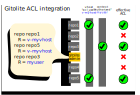

### Selecting which repos to show on a vhost

By default, no repo is allowed to be shown, even when the vhost has supplied the
`repo_base_dir` config.

You can override this simply to get started by providing the vhost `.acl_user`
name of "@all" as the example code does.  This will allow libjsongit2 to show
the contents of any repo in the `repo_base_dir`.

For a real server, libjsongit2 uses gitolite ACLs to control which vhosts
can see what.  It's not uncommon for a server to have several HTTP vhosts, but
only a single system like gitolite handling repos in a single directory.

So it becomes important to restrict the view of the different vhosts to the
repos that are relevant to them.  Rather than reinvent the wheel, libjsongit2
lets you configure what it will show using gitolite config.



If the gitolite well-known repo `gitolite-admin` is present in the repo
directory, it is parsed automatically using the vhost's `acl_user` to discover
the ACLs possible for this vhost.

Additionally, when creating the context for a specific transaction, you can
pass in an authorized username for the transaction using the `authorized`
parameter in the context creation api.  If non-NULL, this adds to the repos
already available from selecting using the vhost `acl_user` name.

#### Allow gitolite to set repo gitweb config

Gitohashi acquires gitweb repo information from the bare repo config file, at
`myrepo.git/config`.  You can set these by hand using git config syntax if you
want, by adding a section like this...

```
[gitweb]
        description = libwebsockets lightweight C networking library
        url = https://libwebsockets.org/repo/libwebsockets
        owner = Andy Green <andy@warmcat.com>
```

...but if you are already using gitolite, rather than have to ssh in and edit
the bare repo config each time, it's much more convenient to define and manage
these in the same gitolite config file used for repo creation and ACLs already.

Gitolite supports it but to allow the gitolite config file to alter the bare
repo config, you must one-time whitelist the gitweb-related keys we want to
control from there in `.gitolite.rc` in your gitolite user home dir.

```
$GL_GITCONFIG_KEYS = "gitweb.description gitweb.owner gitweb.url";
```

Then, in your usual gitolite config you can do this kind of thing

```
repo libwebsockets
        RW+     =  @ag
        R       =  v-lws
        config gitweb.description = "libwebsockets lightweight C networking library"
        config gitweb.owner = "Andy Green <andy@warmcat.com>"
        config gitweb.url = "https://libwebsockets.org/repo/libwebsockets"
```

When you update the gitolite-admin remote repo, it will apply the defined
config into the remote repos' config immediately.  In pages rendered by
gitohashi, the updated gitweb information will be reflected immediately.

#### Set up per-vhost virtual users

libjsongit2 can understand gitolite ACLs for the repos.  You can associate a
libjsongit2 vhost with a user name in your gitolite config, and that vhost will
show on the web any repo that the user name has access to.

The user name doesn't have to be a real user with ssh keys.

Eg, here we give the "user" v-lws read access to `libwebsockets`...

```
repo libwebsockets
        RW+     =  @ag
        R       =  v-lws
```

if we tell the libjsongit2 vhost its acl-user is also `v-lws`, it will
understand it should serve the `libwebsockets` repo and any other repos `v-lws`
has read access to.

No other repo will be opened by gitohashi for serving.
